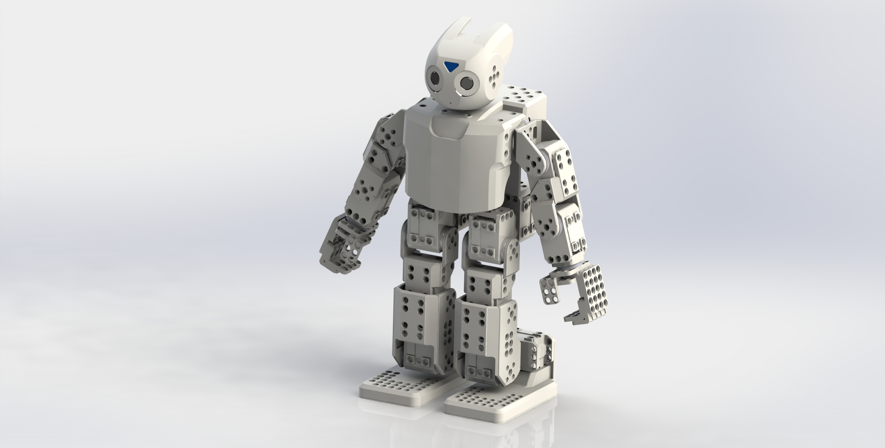
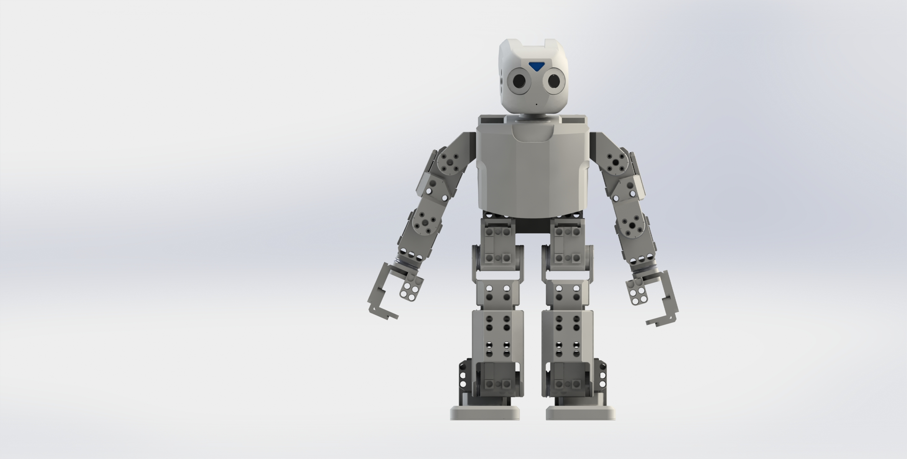

# Darwin_mini

I created the CAO of Darwin_mini with SolidWorks 2015. All of the parts are available in  STL or STEP files. I created most of the parts with SolidWorks, so it is possible to change easily this part. But a few part are imported files

 The hardware work is licensed under a <a rel="license" href="http://creativecommons.org/licenses/by-sa/4.0/">Creative Commons Attribution-ShareAlike 4.0 International License</a>.

